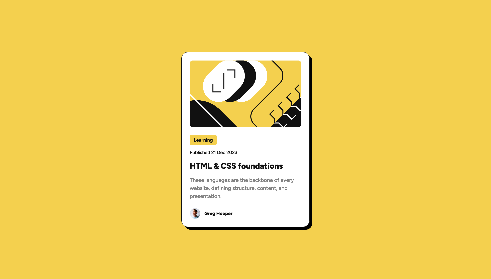

# Frontend Mentor - Blog preview card solution

This is a solution to the [Blog preview card challenge on Frontend Mentor](https://www.frontendmentor.io/challenges/blog-preview-card-ckPaj01IcS). Frontend Mentor challenges help you improve your coding skills by building realistic projects.

## Table of contents

- [Overview](#overview)
  - [The challenge](#the-challenge)
  - [Screenshot](#screenshot)
  - [Links](#links)
- [My process](#my-process)
  - [Built with](#built-with)
  - [What I learned](#what-i-learned)
  - [Continued development](#continued-development)
  - [Useful resources](#useful-resources)
- [Author](#author)

## Overview

### The challenge

Users should be able to:

- See hover and focus states for all interactive elements on the page

### Screenshot

### Links

- Solution URL: [Add solution URL here](https://your-solution-url.com)
- Live Site URL: [Add live site URL here](https://your-live-site-url.com)

## My process

### Built with

- Semantic HTML5 markup
- CSS custom properties
- Flexbox
- CSS Grid

### What I learned

I learnt some more about custom properties.
I got the font files in woff2 from google-font-helper and used 'font-face'.
I also used pseudo classes on the heading.

### Continued development

I'd like to learn more about custom properties and responsiveness.

### Useful resources

- [Google Webfonts Helper](https://gwfh.mranftl.com/fonts) - This helped me get the woff2 files for the google font.

## Author

- Frontend Mentor - [@yourusername](https://www.frontendmentor.io/profile/lkeating26)

*
